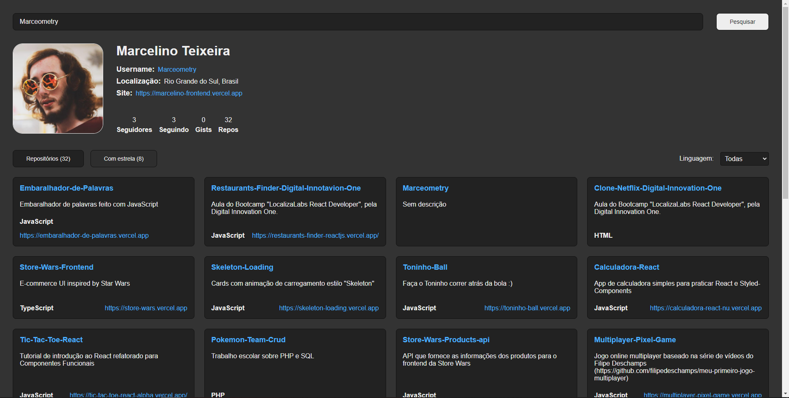

<h1 align="center">
  Github API
</h1>

  <a href="#-tecnologias">Tecnologias</a>&nbsp;&nbsp;&nbsp;|&nbsp;&nbsp;&nbsp;
  <a href="#-projeto">Projeto</a>&nbsp;&nbsp;&nbsp;|&nbsp;&nbsp;&nbsp;
  <a href="#-funcionalidades">Funcionalidades</a>

 

  

## 🧪 Tecnologias

Esse projeto foi desenvolvido com as seguintes tecnologias:

- [ReactJS](https://reactjs.org/)
- [Styled-Components](https://styled-components.com/)
- [Github API](https://docs.github.com/en/rest)

## 💻 Projeto

<h4> Acesse em: https://restaurants-finder-reactjs.vercel.app/ </h4>

Este projeto foi feito durante o curso "Criando um front-end totalmente componentizado na prática com ReactJS", do Bootcamp [LocalizaLabs React Developer](https://web.digitalinnovation.one/track/localizalabs-react-developer), pela plataforma [Digital Innovation One](https://web.digitalinnovation.one/home).

## 💣 Funcionalidades

- Conexão com a API do Github, obtendo acesso aos dados públicos de usuários e seus repositórios.
- Busca por nome de usuário com animações de carregamento "skeleton".
- Alternar entre mostrar no CSS-Grid os repositórios do usuário e os repositórios favoritados.
- Filtragem dos repositórios por linguagem (JavaScript, TypeScript, etc).

---

<h4 align="center"> Feito com ♥ por Marcelino Teixeira </h4>
